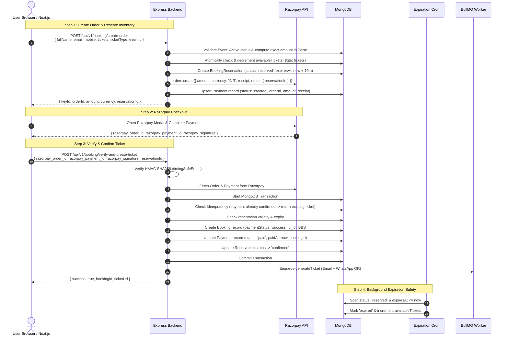

# Express-First Razorpay Integration & Inventory Reservation Architecture

This plan transitions **all sensitive payment, verification, reservation, and inventory logic entirely into the Express backend**. Next.js acts merely as a thin UI / pass-through client, preventing any tampering, race conditions, price manipulations, or duplicate bookings.

---

## 🔒 Security & Architecture Principles

1. **Zero Trust on Client Data**: Amount, pricing, and ticket availability are never decided or computed by the frontend. The backend fetches event prices from DB and calculates amounts in paise.
2. **True Razorpay Ownership**: Express holds `RAZORPAY_KEY_ID` and `RAZORPAY_KEY_SECRET`. Express creates the Razorpay Order and performs cryptographic HMAC-SHA256 signature verification directly with Razorpay SDK / API.
3. **Atomic Capacity Reservation**: Seats are decremented using atomic MongoDB `$gte` conditions before an order is created. If payment fails or expires, a cron job atomically releases seats back.
4. **Idempotent Ticket Issuance**: If the user/browser triggers verify multiple times or networks retry, the transaction and uniqueness constraints (`unique: true` on `orderId` and `paymentId`) prevent double ticket creation.
5. **Webhook Asynchronous Reconciliation**: A dedicated Razorpay webhook endpoint (`/api/v1/payment/webhook`) catches network drops, user closing browser tabs before redirect, or refunds.

---

## End-to-End Workflow Diagram



---

## User Review Required

> [!IMPORTANT]
> **Environment Variables Required in Express `.env`**:
> ```env
> RAZORPAY_KEY_ID=rzp_test_... or rzp_live_...
> RAZORPAY_KEY_SECRET=your_razorpay_key_secret
> RAZORPAY_WEBHOOK_SECRET=your_razorpay_webhook_secret (optional for webhook)
> ```
> 
> **Next.js Role**:
> The Next.js app will only need to:
> 1. Call `POST <EXPRESS_URL>/api/v1/booking/create-order`
> 2. Open Razorpay Checkout modal using the returned `keyId` and `orderId`
> 3. Call `POST <EXPRESS_URL>/api/v1/booking/verify-and-create-ticket` with the modal response.

---

## Proposed Changes

### 1. Razorpay Configuration & Client Instance

#### [NEW] [razorpay.config.mjs](file:///c:/Users/deves/Desktop/Projects/Bharat%20Sangam%20Backend/src/config/razorpay.config.mjs)
- Initialize and export `new Razorpay({ key_id: process.env.RAZORPAY_KEY_ID, key_secret: process.env.RAZORPAY_KEY_SECRET })`.

---

### 2. Schemas & Models

#### [MODIFY] [payment.model.mjs](file:///c:/Users/deves/Desktop/Projects/Bharat%20Sangam%20Backend/src/models/payment.model.mjs)
- Ensure fields: `orderId` (unique), `paymentId` (partial unique), `eventId`, `bookingId`, `amount` (paise), `currency`, `receipt`, `status` (`"created" | "attempted" | "paid" | "failed" | "refunded"`), `phone`, `email`, `method`, `notes`, `razorpaySignature`, `paidAt`, `webhookLogs`.

#### [MODIFY] [bookingReserveModel.mjs](file:///c:/Users/deves/Desktop/Projects/Bharat%20Sangam%20Backend/src/models/bookingReserveModel.mjs)
- Ensure partial index on `{ eventId: 1, phone: 1, status: 1 }` where `status: "reserved"`.
- Store `ticketType`, `totalTicket`, `expiresAt`, `orderId`, `paymentId`, `bookingId`.

#### [MODIFY] [bookingModel.js](file:///c:/Users/deves/Desktop/Projects/Bharat%20Sangam%20Backend/src/models/bookingModel.js)
- Ensure indexes: `{ eventId: 1, phone: 1 }`, `{ u_id: 1 }`.

---

### 3. Request Validations (Zod)

#### [NEW] [booking.validation.mjs](file:///c:/Users/deves/Desktop/Projects/Bharat%20Sangam%20Backend/src/validations/booking.validation.mjs)
- `createOrderSchema`:
  - `fullName`: string min 2
  - `email`: string email
  - `mobile`: 10-digit number / string
  - `tickets`: integer 1-5
  - `ticketType`: string (or ID)
  - `eventId`: 24-char ObjectId
- `verifyPaymentAndCreateTicketSchema`:
  - `razorpay_order_id`: string
  - `razorpay_payment_id`: string
  - `razorpay_signature`: string
  - `reservationId`: 24-char ObjectId

---

### 4. Controller Logic

#### [MODIFY] [booking.controller.mjs](file:///c:/Users/deves/Desktop/Projects/Bharat%20Sangam%20Backend/src/controllers/booking.controller.mjs)
Implement two clean, secure endpoints:

1. **`createBookingOrder` (`POST /booking/create-order`)**:
   - Validate input.
   - Fetch event from DB and verify it is active and not ended.
   - Validate selected `ticketType` and calculate trusted price (e.g., `price * tickets * 100` paise).
   - Check if the phone already booked this event.
   - Check for existing valid active reservation for this phone + event (if exists, reuse or refresh).
   - Atomically decrement `availableTickets` and increment `bookedSeats` using `eventModel.findOneAndUpdate({ _id: eventId, isActive: true, availableTickets: { $gte: tickets } }, ...)`
   - Create `bookingReserveModel` document (10-minute expiry).
   - Call Razorpay API `razorpayInstance.orders.create({ amount, currency: "INR", receipt: "rcpt_...", notes: { reservationId: res._id.toString(), eventId, phone } })`.
   - Save initial `Payment` record with `status: "created"`.
   - Return `{ success: true, keyId, orderId, amount, currency: "INR", reservationId, eventName, ticketType, tickets }`.

2. **`verifyAndCreateTicket` (`POST /booking/verify-and-create-ticket`)**:
   - Verify Razorpay Signature using `crypto.createHmac("sha256", secret).update(order_id + "|" + payment_id).digest("hex")` with `crypto.timingSafeEqual`.
   - Fetch order and payment details from Razorpay API to verify status is captured/authorized, amount matches, and currency is INR.
   - Start Mongo transaction (`session.startTransaction()`):
     - **Idempotency**: If payment `orderId` or `paymentId` is already marked `paid` and has `bookingId`, return existing ticket immediately.
     - Validate `bookingReserveModel` by `reservationId`, verifying status is `"reserved"`, matching phone, event, and `expiresAt > new Date()`.
     - Check no confirmed booking exists for this phone and event.
     - Generate `u_id` (`BBS######`).
     - Create booking document in `bookingModel`.
     - Update `Payment` document with status `"paid"`, `bookingId`, `paymentId`, `method`, `paidAt`, `razorpaySignature`.
     - Mark `bookingReserveModel` as `"confirmed"`.
     - Commit transaction.
   - Enqueue ticket rendering to BullMQ `ticketQueue.add("generateTicket", ...)`.
   - Return `{ success: true, message: "Ticket created", bookingId: ticket.u_id }`.

---

### 5. Routes & Webhook Setup

#### [MODIFY] [booking.route.mjs](file:///c:/Users/deves/Desktop/Projects/Bharat%20Sangam%20Backend/src/routes/booking.route.mjs)
- Mount `POST /create-order`
- Mount `POST /verify-and-create-ticket`
- Keep existing `/details`, `/ticket-detail`, `/ticket-verify`, etc.

#### [NEW] [paymentWebhook.controller.mjs](file:///c:/Users/deves/Desktop/Projects/Bharat%20Sangam%20Backend/src/controllers/paymentWebhook.controller.mjs) & [payment.route.mjs](file:///c:/Users/deves/Desktop/Projects/Bharat%20Sangam%20Backend/src/routes/payment.route.mjs)
- Add `POST /api/v1/payment/webhook` with `validateWebhookSignature` to handle `payment.captured`, `payment.failed`, and `refund.processed` for backup reconciliation.

---

### 6. Background Expiry Cron

#### [MODIFY] [cron.mjs](file:///c:/Users/deves/Desktop/Projects/Bharat%20Sangam%20Backend/src/config/cron.mjs) & [index.mjs](file:///c:/Users/deves/Desktop/Projects/Bharat%20Sangam%20Backend/index.mjs)
- Enable `startCronJobs()` in `index.mjs`.
- In `cron.mjs`, handle batch expiration of expired reservations, atomically returning `availableTickets` (`$inc: { availableTickets: reservation.totalTicket, bookedSeats: -reservation.totalTicket }`) and setting reservation status to `"expired"`.

---

## Verification Plan

### Automated / Manual Test Steps
1. **Order Creation & Capacity Reservation**:
   - `POST /api/v1/booking/create-order` with payload:
     ```json
     {
       "fullName": "Test User",
       "email": "test@example.com",
       "mobile": "9876543210",
       "tickets": 2,
       "ticketType": "Regular",
       "eventId": "<valid_event_id>"
     }
     ```
   - Verify Razorpay order ID is returned, `availableTickets` decreases by 2, and reservation is in DB.
2. **Sold-out Prevention**:
   - Attempt to reserve more than `availableTickets`; ensure proper `400 Tickets sold out` rejection with no orphaned DB records.
3. **Cryptographic Verification & Ticket Creation**:
   - `POST /api/v1/booking/verify-and-create-ticket` with valid signature and test payment.
   - Verify transaction commits, ticket is created, reservation is marked `confirmed`, and worker is enqueued.
4. **Tamper Test**:
   - Modify signature or orderId and verify `400 Payment signature verification failed` error.
5. **Idempotency Test**:
   - Resend the exact same verification payload; verify it returns the existing booking safely.
6. **Cron Auto-Release Test**:
   - Create a test reservation, set its `expiresAt` in the past, let cron run, and verify `availableTickets` increments back.
